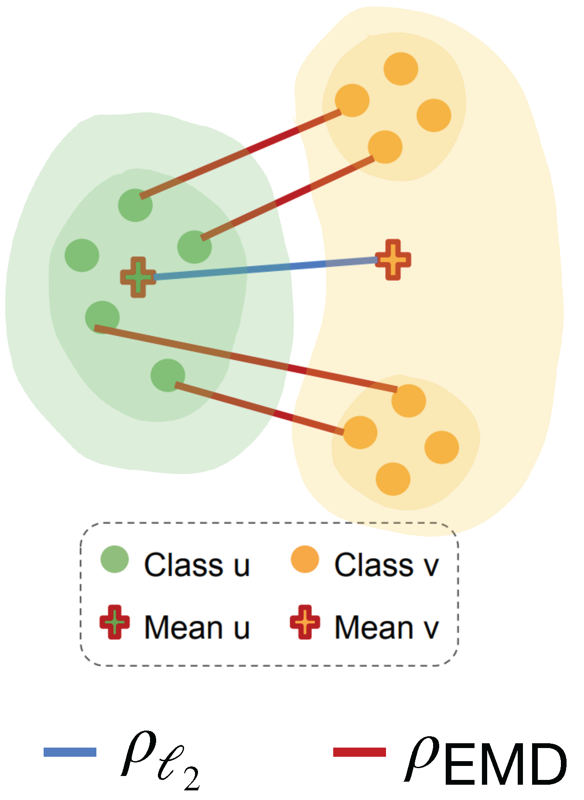

# [ICLR'25] OTCPCC
[Paper](https://arxiv.org/abs/2410.03052) | [Slides](https://iclr.cc/virtual/2025/poster/30615) | [Poster](https://iclr.cc/virtual/2025/poster/30615) | [Video](https://recorder-v3.slideslive.com/?share=98703&s=0b8ceaa4-f841-4138-ba6c-4331b8bf0e6c) | [OpenReview](https://openreview.net/forum?id=AnL6BuWzxa)

This is the official repository for [Learning Structured Representations by Embedding Class Hierarchy with Fast Optimal Transport](https://arxiv.org/abs/2410.03052) proposed in our ICLR 2025 paper.

## Introduction
To embed structured knowledge within labels into feature representations, [Zeng et al., 2022](https://github.com/uiuctml/HierarchyCPCC) proposed to use the **C**o**p**henetic **C**orrelation **C**oefficient (CPCC) as a regularizer during supervised learning. This regularizer calculates pairwise Euclidean distances of class means and aligns them with the corresponding shortest path distances derived from the label hierarchy tree. However, class means may not be good representatives of the class conditional distributions, especially when they are multi-mode in nature. To address this limitation, under the CPCC framework, we propose to use the Earth Mover's Distance (EMD) to measure the pairwise distances among classes in the feature space. We show that our exact EMD method generalizes previous work, and recovers the existing algorithm when class-conditional distributions are Gaussian. To further improve the computational efficiency of our method, we introduce the **O**ptimal **T**ransport-CPCC family by exploring four EMD approximation variants. Our most efficient OT-CPCC variant, the proposed Fast FlowTree algorithm, runs in linear time in the size of the dataset, while maintaining competitive performance across datasets and tasks.

<p align="center">
    
</p>

**Core CPCC reguluarization features are implemented in `loss.py`, and optimal transport methods are implemented in `emd/emd_methods.py`**. 

Please use the following instructions to run experiments in our paper.


## Preparation
- To download the repository and install all necessary requirements, run 
```
git clone https://github.com/uiuctml/OTCPCC.git
conda env create -n hierarchytorch2 --file environment.yml
```

## Logging
We use `wandb` for logging metrics to the cloud. All intermediate evaluation metrics and code will be automatically uploaded after you have set up your wandb account. For local debugging, you can also run `wandb disabled` before starting experiments, so your checkpoints will be automatically saved in your local results folder.

## Pretraining
Most training snippets are included in `pretrain.py`. Here we explain some important configuration arguments. 

- `--root`: directory that you want to save your experiment results. Once experiment starts, all outputs will be stored in `<your specified root>/hierarchy_results/<DATASET>/<EXPERIMENT ID>`, or if you run experiments on BREEDS, outputs will be saved in `<your specified root>/hierarchy_results/<DATASET>/<EXPERIMENT ID>/<BREEDS SETTING>`.

- `--timestamp`: a unique id to identify your experiment. You can use `datetime.now().strftime("%m%d%Y%H%M%S")` if you want to timestamp as the identifier.

- `--dataset`: any of `CIFAR10`, `CIFAR100`, `BREEDS` or `INAT`. 
- `--breeds_setting`: default `BREEDS` split including `living17`, `nonliving26`, `entity13` or `entity30`. 
- `--cpcc`: any of `l2` (Euclidean CPCC), `emd` (Exact Earth Mover's Distance), `sk` (Sinkhorn), `swd` (Sliced Wasserstein Distance), `fft` (Fast FlowTree) or empty string (Flat).
- `--lamb`: regularization factor of CPCC regularizer. Default value is 1. 

All default pretraining hyperparameters are saved in json files under corresponding dataset folders. `pre.json` contains pretraining parameters.

Please see `cmd/pretrain.sh` as reference for sample pretraining configurations. `DistributedDataParallel` is only supported on `BREEDS` and `INAT`.

## Downstream Tasks
### In-distribution Classification Evaluation
This is implemented in `eval_source` function in `pretrain.py`, where we use the model pretrained on source-train split and evaluate on source-test split. Please use the correct training arguments as in pretraining configurations in the previous section, and set `--train 0` to only run evaluation code.

### Others
All other evaluation features are implemented in  `downstream.py`, which includes test CPCC, subpopulation shift fine-tuning on target split for hierarchical classification, and all retrieval experiments. The command arguments are similar to the pretraining script and please refer to examples in `cmd/downstream.sh`.

## Acknowledgement
Our repository is built upon [HierarchyCPCC](https://github.com/uiuctml/HierarchyCPCC), [breeds](https://github.com/MadryLab/BREEDS-Benchmarks) and [pot](https://pythonot.github.io/).

## Citation
If you find our work helpful, please consider cite our paper:

```
@inproceedings{
zeng2025learning,
title={Learning Structured Representations by Embedding Class Hierarchy with Fast Optimal Transport},
author={Siqi Zeng and Sixian Du and Makoto Yamada and Han Zhao},
booktitle={The Thirteenth International Conference on Learning Representations},
year={2025},
url={https://openreview.net/forum?id=AnL6BuWzxa}
}
```

## Contact
Please contact siqi6@illinois.edu for any questions or comments.
